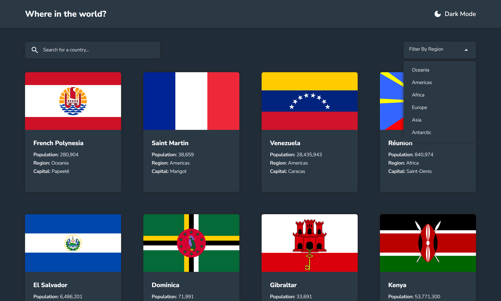
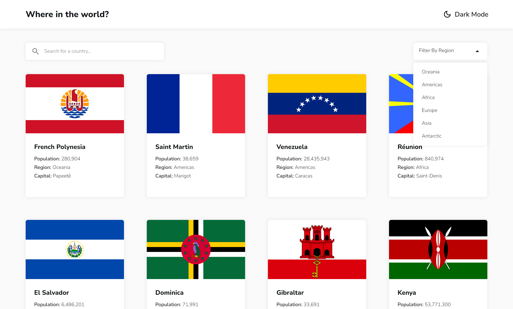
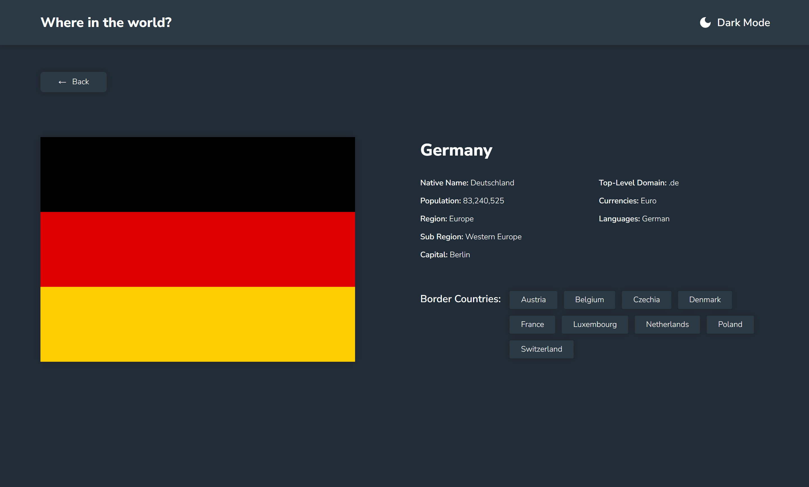
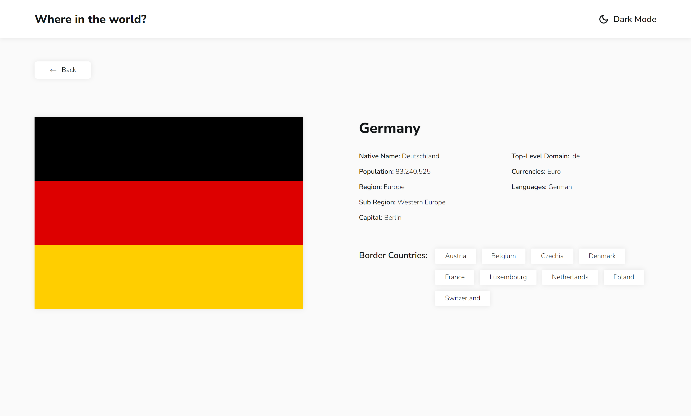

# Frontend Mentor - REST Countries API with color theme switcher solution

This is a solution to the [REST Countries API with color theme switcher challenge on Frontend Mentor](https://www.frontendmentor.io/challenges/rest-countries-api-with-color-theme-switcher-5cacc469fec04111f7b848ca). Frontend Mentor challenges help you improve your coding skills by building realistic projects. 

## Table of contents

- [Overview](#overview)
  - [The challenge](#the-challenge)
  - [Screenshot](#screenshot)
  - [Links](#links)
- [My process](#my-process)
  - [Built with](#built-with)
  - [What I learned](#what-i-learned)
- [Author](#author)
**Note: Delete this note and update the table of contents based on what sections you keep.**

## Overview

### The challenge

Users should be able to:

- See all countries from the API on the homepage
- Search for a country using an `input` field
- Filter countries by region
- Click on a country to see more detailed information on a separate page
- Click through to the border countries on the detail page
- Toggle the color scheme between light and dark mode *(optional)*

### Screenshot

### Links

- Solution URL: [https://github.com/yukilun/rest-countries-api-with-color-theme-switcher](https://github.com/yukilun/rest-countries-api-with-color-theme-switcher)
- Live Site URL: [https://yukilun.github.io/rest-countries-api-with-color-theme-switcher/](https://yukilun.github.io/rest-countries-api-with-color-theme-switcher/)

## My process

### Built with
- [Vue.js](https://vuejs.org/) - JS library
- [Vue Router](https://router.vuejs.org/) - Official router for Vue.js 
- [Pinia](https://pinia.vuejs.org/) - State management library for Vue.js 
- [Tailwind CSS](https://tailwindcss.com/) - CSS Framework
- [AOS](https://michalsnik.github.io/aos/) - Animate On Scroll Library

### What I learned

- Transformed existing responsive web design into code
- Utilized Vue + Vue router for single-page application (SPA) developement
- Utilized Pinia for state management
- Built theme switcher with Vue + Tailwind CSS
- Used Fetch API to fetch data from REST countries API

## Author

- Website - [Yuki Lun](https://www.yukilun.com)
- Frontend Mentor - [@yukilun](https://www.frontendmentor.io/profile/yukilun)